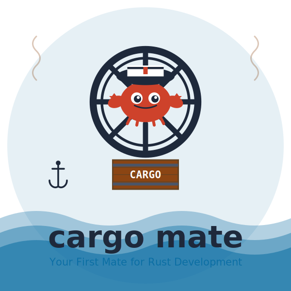

[](https://github.com/cyber-boost/cargo-mate)
A powerful Rust development companion that enhances cargo with intelligent workflows, state management, performance optimization, and comprehensive project monitoring.

## Table of Contents

- [Quick Start](#-quick-start)
- [Command Reference](#-command-reference)
  - [Journey Commands](#journey-commands)
  - [Anchor Commands](#anchor-commands)
  - [Log Commands](#log-commands)
  - [Tide Commands](#tide-commands)
  - [Map Commands](#map-commands)
  - [Mutiny Commands](#mutiny-commands)
  - [Config Commands](#config-commands)
  - [Version Commands](#version-commands)
  - [View Commands](#view-commands)
  - [Optimize Commands](#optimize-commands)
  - [General Commands](#general-commands)
- [Installation](#-installation)
- [Configuration](#️-configuration)
- [Examples](#-examples)
- [License](#-license)

## MOST IMPORANT : AFTER INSTALL RUN 
cm install && cm activate 

### Journey Commands
```bash
cm journey                 # Show journey overview
cm journey record <name>   # Start recording a journey
cm journey play <name>     # Play a recorded journey
cm journey list            # List all recorded journeys
cm journey export <name>   # Export a journey
cm journey import <path>   # Import a journey
cm journey publish <name>  # Publish journey for sharing
cm journey download <id>   # Download published journey
cm journey search <query>  # Search marketplace journeys
cm journey published       # List your published journeys
```

### Anchor Commands
```bash
cm anchor                  # Show anchor overview
cm anchor save <name>      # Save current project state
cm anchor restore <name>   # Restore saved state
cm anchor list             # List all saved anchors
cm anchor show <name>      # Show anchor details
cm anchor diff <name>      # Compare with anchor state
cm anchor auto <name>      # Auto-save anchor for project
cm anchor stop <name>      # Stop auto-update mode
```

### Log Commands
```bash
cm log                     # Show log overview
cm log add <message>       # Add a new log entry
cm log search <query>      # Search through log entries
cm log timeline <days>     # Display timeline view
cm log export <path>       # Export logs to external format
cm log analyze             # Analyze log patterns and statistics
```

### Tide Commands
```bash
cm tide                    # Show tide overview
cm tide show               # Display performance charts
cm tide analyze            # Analyze dependencies
cm tide export <path>      # Export performance data
```

### Map Commands
```bash
cm map                     # Show map overview
cm map show                # Display dependency tree
cm map analyze             # Analyze project structure
cm map export <path>       # Export map data
cm map path <from> <to>    # Show dependency paths
```

### Mutiny Commands
```bash
cm mutiny                  # Show mutiny overview
cm mutiny activate <reason> # Activate mutiny mode
cm mutiny deactivate       # Deactivate mutiny mode
cm mutiny allow-warnings   # Allow warnings temporarily
cm mutiny skip-tests       # Skip tests in mutiny mode
cm mutiny force            # Force operations
cm mutiny yolo             # Enable YOLO mode (maximum risk)
cm mutiny status           # Show current mutiny status
```

### Config Commands
```bash
cm config                  # Show config overview
cm config set <key> <val>  # Set a config value
cm config get <key>        # Get a config value
cm config list             # List all configuration
cm config init             # Initialize local config
cm config shortcut <name>  # Add a shortcut
cm config hook <type>      # Add a hook
```

### Version Commands
```bash
cm version                 # Show version overview
cm version init [<ver>]    # Initialize version management
cm version info            # Show version information
cm version increment <type> # Increment version (patch/minor/major)
cm version set <version>   # Set specific version
cm version history         # Show version history
cm version update-cargo    # Update Cargo.toml version
cm version config enable   # Enable auto-increment
cm version config disable  # Disable auto-increment
cm version config policy   # Set increment policy
cm version config show     # Show version configuration
```

### View Commands
```bash
cm view                    # Show view overview
cm view errors             # View all errors and warnings
cm view artifacts          # View generated files and locations
cm view scripts            # View build script outputs
cm view history            # View detailed build history
cm view checklist          # View checklist and fixes
cm view all                # View all results in one place
cm view latest             # Quick view of latest issues
cm view open               # Open results in file explorer
```

### Optimize Commands
```bash
cm optimize                # Show optimization overview
cm optimize aggressive     # Apply aggressive optimizations
cm optimize balanced       # Apply balanced optimizations
cm optimize conservative   # Apply conservative optimizations
cm optimize custom         # Apply custom optimizations
cm optimize status         # Show current optimization status
cm optimize recommendations # Show optimization recommendations
cm optimize restore        # Restore original Cargo.toml
```

### General Commands
```bash
cm init                    # Initialize cargo-mate project
cm install                 # Install shell integration
cm activate                # Activate shell integration
cm checklist               # Show project checklist
cm history [<kind>] [<limit>] # Show command history
cm exec <cargo_args>       # Execute cargo commands
cm --help                  # Show help information
cm --version               # Show version information
```

### Journey Recording & Playback
Record your command sequences and replay them perfectly. Great for onboarding, CI/CD, and sharing workflows.
```bash
cm journey record build-flow    # Start recording
# ... do your work ...
# Ctrl+D to stop
cm journey play build-flow      # Replay the journey
```

### ⚓ Anchor Points (with Auto-Update)
Save and restore complete project states, including Git commits, dependencies, and files. Now with automatic background updating that keeps your anchor current as you work!

**Manual Mode:**
```bash
cm anchor save before-refactor  # Save current state
# ... make changes ...
cm anchor restore before-refactor  # Restore if needed
```

**Auto-Update Mode:**
```bash
# Start background auto-updating (recommended)
cm anchor auto my-project

# Start foreground auto-updating (blocking)
cm anchor auto my-project --foreground

# Files are automatically updated when you edit them!
# You'll see notifications like:
# [14:32:15] Updated src/main.rs in anchor 'my-project'

# Stop auto-update when done
cm anchor stop my-project
```

**Auto-Update Features:**
- **Real-time Updates**: Files are saved to anchor immediately when changed
- **Background Mode**: Non-blocking, runs while you continue working
- **Efficient**: Only updates specifically modified files
- **Smart Monitoring**: Automatically watches relevant directories
- **Easy Control**: Simple start/stop commands

### Captain's Log
Natural language build notes with automatic tagging and search.
```bash
cm log add "Switching to async runtime" --tags async,refactor
cm log timeline 7               # Show last 7 days
cm log search "performance"     # Search logs
```

### 🌊 Tide Charts
Interactive performance tracking and build analytics.
```bash
cm tide show                    # Interactive charts
cm tide analyze                 # Dependency analysis
```

### Treasure Maps
Visualize and analyze your dependency tree.
```bash
cm map show                     # Show dependency tree
cm map path serde tokio         # Find path between deps
cm map analyze                  # Full analysis
```

### Mutiny Mode
Override cargo's restrictions when you know what you're doing.
```bash
cm mutiny allow-warnings        # Temporarily allow warnings
cm mutiny skip-tests            # Skip tests for quick builds
cm mutiny yolo                  # DANGER: Disable all checks for 30 min
```

### Auto-Versioning
Automatic version incrementing with semantic versioning support.
```bash
cm version init                 # Initialize versioning
cm version increment minor      # Manual version bump
# Auto-increments on every build/check operation
```

### Build Optimization
Automatically optimize your Cargo.toml for maximum build performance.
```bash
cm optimize aggressive          # Maximum speed optimizations
cm optimize balanced            # Balanced speed/stability
cm optimize recommendations     # Get optimization advice
cm optimize restore             # Restore original settings
```

### Smart Configuration
Project-local and global configuration with shortcuts and hooks.
```bash
cm config init                  # Create local .cg config
cm config shortcut b "build --release" --local
cm config hook pre_build "cargo fmt"
```

### Build Result Viewing
Comprehensive viewing of build results, artifacts, and generated files.
```bash
cm view errors                  # View all errors
cm view artifacts              # View generated files
cm view all                    # View everything in one place
```

### Smart Error Parsing
Transforms cargo errors into actionable checklists with fix suggestions.
```bash
cm checklist                    # Show current error/warning checklist
cm history errors 10            # Show last 10 errors
```

## 🔧 Installation

### 🚀 Universal Installer (Recommended - Works Everywhere)
```bash
curl -sSL https://get.cargo.do/mate | bash
```
✅ No compilation needed, auto-detects platform, handles all dependencies

### 📦 Direct Download - Choose Your Platform
```bash
# Linux x86_64
wget https://get.cargo.do/linux-x86-64.tar.gz
tar -xzf linux-x86-64.tar.gz && ./install.sh

# Linux ARM64
wget https://get.cargo.do/linux-arm64.tar.gz
tar -xzf linux-arm64.tar.gz && ./install.sh

# macOS Intel
wget https://get.cargo.do/macos-x86-64.tar.gz
tar -xzf macos-x86-64.tar.gz && ./install.sh

# macOS Apple Silicon
wget https://get.cargo.do/macos-arm64.tar.gz
tar -xzf macos-arm64.tar.gz && ./install.sh

# Windows
wget https://get.cargo.do/windows-x86-64.tar.gz
tar -xzf windows-x86-64.tar.gz
# Run install.ps1 in PowerShell
```

### 🔧 From Source via Cargo
```bash
# Prerequisites: apt install build-essential (or equivalent)
cargo install cargo-mate
```
⚠️ **Note**: Requires C compiler/linker. If you get "linker cc not found", use the universal installer instead.

## Configuration

### Project Configuration (.cg)
```toml
[project]
name = "my-project"
default_journey = "build"
auto_checklist = true

[version]
auto_increment = true
increment_policy = "patch"

[shortcuts]
build = "build --release"
test = "test --all"
```

### Global Configuration (~/.shipwreck/config.toml)
```toml
[ui]
colors = true
verbose = false

[performance]
parallel_jobs = 4
incremental = true
```

## Some Examples

### Development Workflow
```bash
# Save current state before major changes
cm anchor save "pre-refactor"

# Record your development workflow
cm journey record "dev-workflow"
cargo check
cargo test
cargo build --release
# Ctrl+D to stop recording

# Replay the workflow anytime
cm journey play "dev-workflow"
```

### Performance Optimization
```bash
# Check optimization recommendations
cm optimize recommendations

# Apply balanced optimizations
cm optimize balanced

# Monitor build performance
cm tide show
```

### Version Management
```bash
# Initialize with semantic versioning
cm version init 1.0.0

# Versions auto-increment on builds
cargo build  # 1.0.0 -> 1.0.1
cargo test   # 1.0.1 -> 1.0.2

# Manual version bump for releases
cm version increment minor  # 1.0.2 -> 1.1.0
```

# 🚢 Cargo Mate
- 🚢 Your project is a ship
- ⚓ Anchors save your position
- 🌊 Tide charts track the flow
- 🗺️ Maps show the territory
- 🏴‍☠️ Mutiny overrides the captain
- 📝 Captain's log records the journey
- 🚢 Auto-versioning keeps your ship on course
- 🚀 Build optimization gives you the wind in your sails


## 📄 BBL License (NOT MIT)

BBL License
For the full license text, visit: [cargo.do/license](https://cargo.do/license)

---

Built with ❤️ for the Rust community. 
No more shipwrecks in the sea of cargo errors!